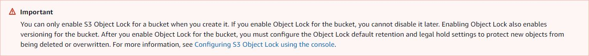

# Labs for AWS S3

## Basic operations on AWS S3 bucket

### Intent:
* Understanding how the basic operations are performed on AWS S3 such as creating bucket(s), uploading/downloading object(s), deleting object(s) and bucket(s)

### Steps

#### Create a bucket
1. Sign in to the AWS Management Console and open the [Amazon S3 console](https://console.aws.amazon.com/s3/).

2. Choose **Create bucket**. The Create bucket wizard opens.

3. In **Bucket name**, enter a DNS-compliant name for your bucket.
    The bucket name must:
    * Be unique across all of Amazon S3.
    * Be between 3 and 63 characters long.
    * Not contain uppercase characters.
    * Start with a lowercase letter or number.

    After you create the bucket, you cannot change its name.

4. In **Region**, choose the AWS Region where you want the bucket to reside.
    Choose a Region close to you to minimize latency and costs and address regulatory requirements. Objects stored in a Region never leave that Region unless you explicitly transfer them to another Region.

5. Under **Object Ownership**, to disable or enable ACLs and control ownership of objects uploaded in your bucket, choose one of the following settings:
    * _ACLs disabled_
        * _Bucket owner enforced_ – ACLs are disabled, and the bucket owner automatically owns and has full control over every object in the bucket. ACLs no longer affect permissions to data in the S3 bucket. The bucket uses policies to define access control.

    * _ACLs enabled_

        * _Bucket owner preferred_ – The bucket owner owns and has full control over new objects that other accounts write to the bucket with the bucket-owner-full-control canned ACL.

            If you apply the bucket owner preferred setting, to require all Amazon S3 uploads to include the bucket-owner-full-control canned ACL, you can add a bucket policy that only allows object uploads that use this ACL.

        * _Object writer_ – The AWS account that uploads an object owns the object, has full control over it, and can grant other users access to it through ACLs.

6. In **Bucket settings for Block Public Access**, choose the Block Public Access settings that you want to apply to the bucket.

    We recommend that you keep all settings enabled unless you know that you need to turn off one or more of them for your use case, such as to host a public website. Block Public Access settings that you enable for the bucket are also enabled for all access points that you create on the bucket.

7. (Optional) If you want to enable S3 Object Lock, do the following:
    1. Choose **Advanced settings**, and read the message that appears.
        
    2. If you want to enable Object Lock, enter **enable** in the text box and choose **Confirm**.

8. Choose **Create bucket**.

#### Upload an object to a bucket
1. Open the [Amazon S3 console](https://console.aws.amazon.com/s3/).
2. In the Buckets list, choose the name of the bucket that you want to upload your object to.
3. On the Objects tab for your bucket, choose Upload.
4. Under Files and folders, choose Add files.
5. Choose a file to upload, and then choose Open.
6. Choose Upload.

#### Download an object from a bucket
1. Sign in to the AWS Management Console and open the [Amazon S3 console](https://console.aws.amazon.com/s3/).
2. In the **Buckets** list, choose the name of the bucket that you want to download an object from.
3. You can download an object from an S3 bucket in any of the following ways:
    * Select the object and choose **Download** or choose **Download as** from the **Actions** menu if you want to download the object to a specific folder.
    * If you want to download a specific version of the object, select the **Show versions** button. Select the version of the object that you want and choose **Download** or choose **Download as** from the **Actions** menu if you want to download the object to a specific folder.

#### Copy an object into a folder
1. In the **Buckets** list, choose your bucket name.

2. Choose **Create folder** and configure a new folder:
    * Enter a folder name (for example, _favorite-pics_).
    * For the folder encryption setting, choose **Disable**.
    * Choose **Save**.

3. Navigate to the Amazon S3 bucket or folder that contains the objects that you want to copy.

4. Select the check box to the left of the names of the objects that you want to copy.

5. Choose **Actions** and choose **Copy** from the list of options that appears.
    Alternatively, choose **Copy** from the options in the upper right.

6. Choose the destination folder:
    * Choose **Browse S3**.
    * Choose the option button to the left of the folder name.
        To navigate into a folder and choose a subfolder as your destination, choose the folder name.
    * Choose **Choose destination**.

    The path to your destination folder appears in the **Destination** box. In **Destination**, you can alternately enter your destination path, for example, s3://```bucket-name```/```folder-name```/.

7. In the bottom right, choose **Copy**.

#### Delete the objects and bucket

##### Deleting an object

1. In the **Buckets** list, choose the name of the bucket that you want to delete an object from.
2. Select the check box to the left of the names of the objects that you want to delete.
3. Choose **Actions** and choose **Delete** from the list of options that appears.
    Alternatively, choose **Delete** from the options in the upper right.
4. Type ```permanently delete``` if asked to confirm that you want to delete these objects.
5. Choose **Delete objects** in the bottom right and Amazon S3 deletes the specified objects.

##### Emptying a bucket
If you plan to delete your bucket, you must first empty your bucket, which deletes all the objects in the bucket.

1. In the **Buckets** list, select the bucket that you want to empty, and then choose **Empty**.
2. To confirm that you want to empty the bucket and delete all the objects in it, in **Empty bucket**, type ```permanently delete```.
3. To empty the bucket and delete all the objects in it, and choose **Empty**.
    An **Empty bucket: Status** page opens that you can use to review a summary of failed and successful object deletions.
4. To return to your bucket list, choose **Exit**.

##### Deleting a bucket
1. To delete a bucket, in the **Buckets** list, select the bucket.
2. Choose **Delete**.
3. To confirm deletion, in **Delete bucket**, type the name of the bucket.
4. To delete your bucket, choose **Delete bucket**.