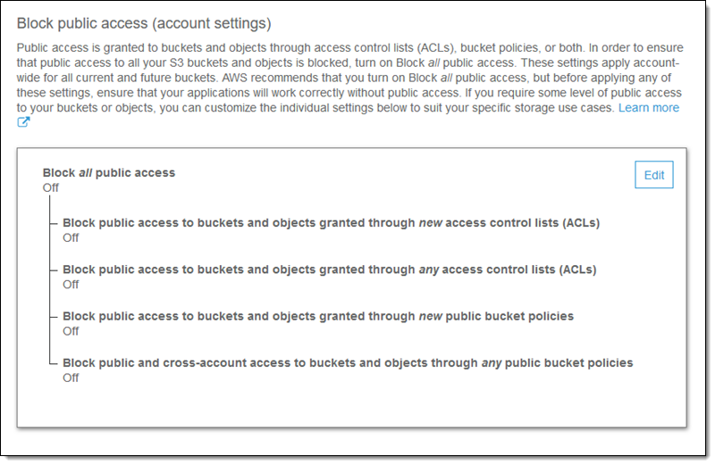

# Amazon Simple Storage Service (S3)

## Security
* User based
    * IAM policies - which API calls should be allowed for a specific user from IAM console
* Resource Based
    * Bucket Policies - bucket wide rules from the S3 console - allows cross account
    * Object Access Control List (ACL) – finer grain
    * Bucket Access Control List (ACL) – less common
* Note: an IAM principal can access an S3 object if
    * the user IAM permissions allow it OR the resource policy ALLOWS it
    * AND there’s no explicit DENY
* Encryption: encrypt objects in Amazon S3 using encryption keys

### Bucket Policies
* JSON based policies
    * Resources: buckets and objects
    * Actions: Set of API to Allow or Deny
    * Effect: Allow / Deny
    * Principal: The account or user to apply the policy to
* Use S3 bucket for policy to:
    * Grant public access to the bucket
    * Force objects to be encrypted at upload
    * Grant access to another account (Cross-Account)

### Bucket settings for Block Public Access

* These settings were created to prevent company data leaks
* If you know your bucket should never be public, leave these on
* Can be set at the account level