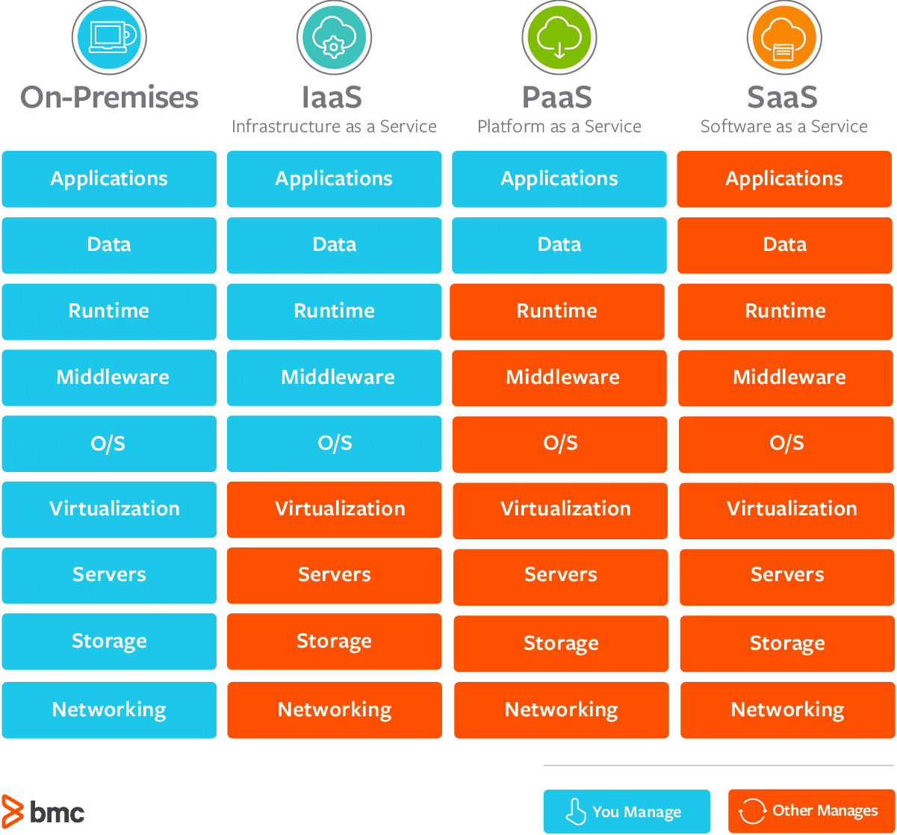

# Introduction
* Cloud computing is the on-demand delivery of compute power, database storage, applications, and other IT resources
* Through a cloud services platform with pay-as-you-go pricing
* You can provision exactly the right type and size of computing resources you need
* You can access as many resources as you need, almost instantly
* Simple way to access servers, storage, databases and a set of application services

# Characteristics
* On-demand self service:
    * Users can provision resources and use them without human interaction from the service provider
* Broad network access:
    * Resources available over the network, and can be accessed by diverse client platforms
* Multi-tenancy and resource pooling:
    * Multiple customers can share the same infrastructure and applications with security and privacy
    * Multiple customers are serviced from the same physical resources
* Rapid elasticity and scalability:
    * Automatically and quickly acquire and dispose resources when needed
    * Quickly and easily scale based on demand
* Measured service:
    * Usage is measured, users pay correctly for what they have used

# Advantages
* Trade capital expense (CAPEX) for operational expense (OPEX)
    * Pay On-Demand: don’t own hardware
    * Reduced Total Cost of Ownership (TCO) & Operational Expense (OPEX)
* Benefit from massive economies of scale
    * Prices are reduced as AWS is more efficient due to large scale
* Stop guessing capacity
    * Scale based on actual measured usage
* Increase speed and agility
* Stop spending money running and maintaining data centers
* Go global in minutes: leverage the AWS global infrastructure

# Deployment models
* Private Cloud:
    * Cloud services used by a single organization, not exposed to the public.
    * Complete control
    * Security for sensitive applications
    * Meet specific business needs
* Public Cloud:
    * Cloud resources owned and operated by a third-party cloud service provider delivered over the Internet.
    * Six Advantages of Cloud Computing
* Hybrid Cloud:
    * Keep some servers on premises and extend some capabilities to the Cloud
    * Control over sensitive assets in your private infrastructure
    * Flexibility and cost-effectiveness of the public cloud

# Problems solved by cloud computing
* Flexibility: change resource types when needed
* Cost-Effectiveness: pay as you go, for what you use
* Scalability: accommodate larger loads by making hardware stronger or adding additional nodes
* Elasticity: ability to scale out and scale-in when needed
* High-availability and fault-tolerance: build across data centers
* Agility: rapidly develop, test and launch software applications

# Types
* Infrastructure as a Service (IaaS)
    * Provide building blocks for cloud IT
    * Provides networking, computers, data storage space
    * Highest level of flexibility
    * Easy parallel with traditional on-premises IT
* Platform as a Service (PaaS)
    * Removes the need for your organization to manage the underlying infrastructure
    * Focus on the deployment and management of your applications
* Software as a Service (SaaS)
    * Completed product that is run and managed by the service provider

# AWS Shared Responsibility
